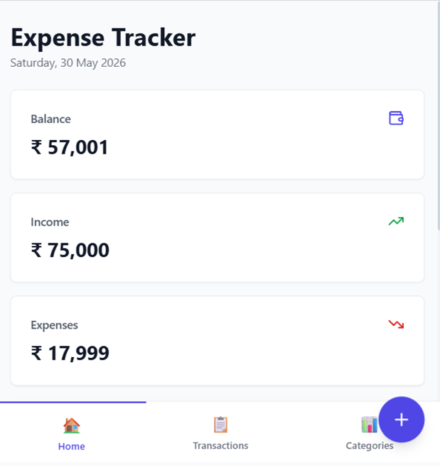
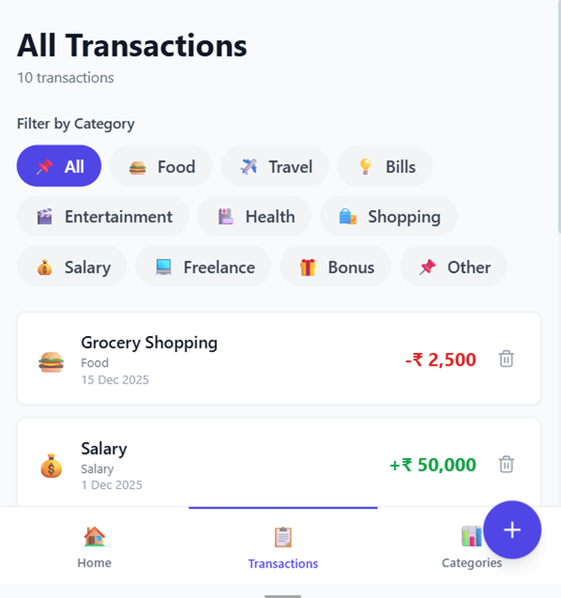
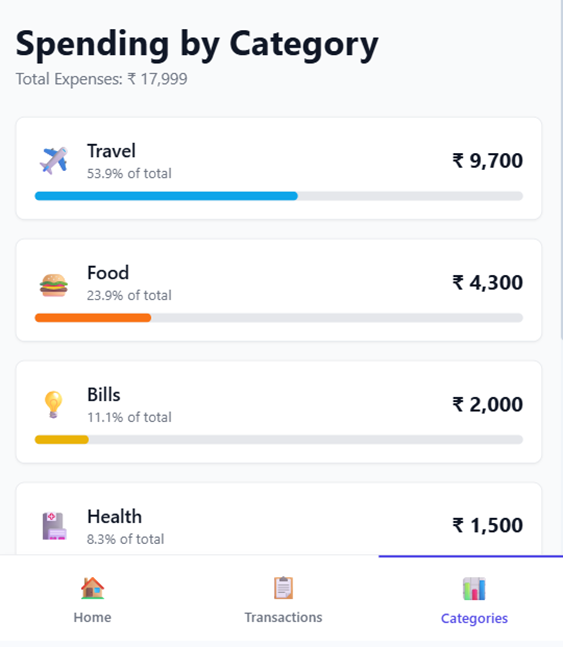
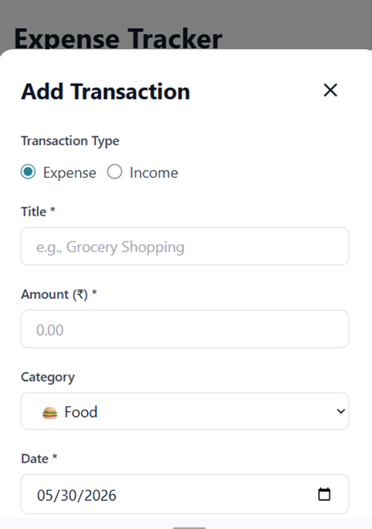

# 💰 Expense Tracker App

A beautiful, production-ready expense tracking application built with **React JS** and **Tailwind CSS**. Track your income and expenses, view detailed analytics by category, and manage your finances with an intuitive, responsive UI.

## 🎯 Features

### ✨ Screens Implemented

1. **Dashboard / Home Screen**
   - Summary cards displaying Total Balance, Total Income, and Total Expenses
   - Recent transactions list (last 5 transactions)
   - Quick-add expense floating action button
   - Visual balance overview

2. **All Transactions Screen**
   - Complete list of all income and expense entries
   - Filter by category (All / Food / Travel / Bills / Entertainment / Health / Shopping / Salary / Freelance / Other)
   - Each transaction shows title, category icon, amount, and date
   - Delete transaction functionality
   - Responsive layout

3. **Add Transaction / Income Screen**
   - Form with title, amount, category selector, date picker
   - Transaction type selector (Income/Expense)
   - Optional description field
   - Input validation with error messages
   - Keyboard-friendly interface
   - Real-time error feedback

4. **Category Summary Screen**
   - Spending breakdown per category
   - Visual progress bars for each category
   - Category percentages
   - Summary statistics (highest spending, number of categories, average spend)
   - Color-coded category representation

5. **Empty & Error States**
   - Proper empty state illustrations for no transactions
   - Inline validation error messages on the Add screen
   - Error feedback on invalid inputs (negative amounts, letters in amount field)

## 🛠️ Tech Stack

- **Frontend Framework**: React JS (Functional Components)
- **Styling**: Tailwind CSS
- **Icons**: Lucide React
- **Build Tool**: Vite
- **Package Manager**: npm
- **State Management**: React Hooks (useState)

## 📁 Project Structure

```
expense-tracker/
├── src/
│   ├── components/          # Reusable UI components
│   │   ├── SummaryCard.jsx
│   │   ├── TransactionCard.jsx
│   │   ├── CategoryBadge.jsx
│   │   ├── FloatingActionButton.jsx
│   │   ├── EmptyState.jsx
│   │   └── Navigation.jsx
│   ├── pages/               # Page screens
│   │   ├── Dashboard.jsx
│   │   ├── AllTransactions.jsx
│   │   ├── CategorySummary.jsx
│   │   └── AddTransactionModal.jsx
│   ├── data/                # Mock data
│   │   └── mockData.js
│   ├── App.jsx              # Main app component
│   ├── App.css              # Minimal app styles
│   ├── index.css            # Tailwind directives
│   └── main.jsx             # React DOM entry point
├── public/                  # Static assets
├── tailwind.config.js       # Tailwind configuration
├── postcss.config.js        # PostCSS configuration
├── vite.config.js           # Vite configuration
├── package.json
└── README.md
```

## 🚀 Getting Started

### Prerequisites

- Node.js (v16 or higher)
- npm (v7 or higher)

### Installation

1. Clone the repository
```bash
git clone <repository-url>
cd expense-tracker
```

2. Install dependencies
```bash
npm install
```

### Running the Application

**Development Mode:**
```bash
npm run dev
```
The app will start on `http://localhost:5173` (or another available port)

**Build for Production:**
```bash
npm run build
```

**Preview Production Build:**
```bash
npm run preview
```

## 📊 Mock Data

All data is hardcoded in `src/data/mockData.js` with:
- 10 sample transactions (mix of income and expenses)
- 10 expense categories with icons and colors
- Realistic transaction data for demonstration

### Sample Categories:
- 🍔 Food
- ✈️ Travel
- 💡 Bills
- 🎬 Entertainment
- 🏥 Health
- 🛍️ Shopping
- 💰 Salary
- 💻 Freelance
- 🎁 Bonus
- 📌 Other

## 🎨 Component Architecture

### Reusable Components:
- **SummaryCard**: Displays financial summary statistics
- **TransactionCard**: Shows individual transaction details
- **CategoryBadge**: Category filter selector
- **FloatingActionButton**: Quick-add action button
- **EmptyState**: Displays empty state messages
- **Navigation**: Bottom navigation bar with tab switching

### Pages:
- **Dashboard**: Home screen with overview
- **AllTransactions**: Full transaction list with filtering
- **CategorySummary**: Analytics by category
- **AddTransactionModal**: Transaction creation form

## 🔧 Key Features & Implementation

### ✅ Form Validation
- Title is required
- Amount must be a positive number (no negatives or letters)
- Date is required
- Real-time error display

### ✅ State Management
- Uses React `useState` hook for:
  - Current page tracking
  - Transactions list management
  - Modal visibility control

### ✅ Navigation
- Bottom tab navigation between Home, Transactions, and Categories
- Smooth screen transitions
- Tab highlighting for active page

### ✅ Data Filtering
- Filter transactions by category
- Instant filtering updates
- "All" option to show all categories

### ✅ UI/UX Features
- Responsive design (mobile, tablet, desktop)
- Tailwind utility classes for all styling
- Consistent color scheme and typography
- Accessible form inputs and buttons
- Loading and empty states
- Transaction deletion with confirmation

## 📱 Responsive Design

- Mobile-first approach
- Breakpoints: sm, md, lg
- Mobile: Stack layout, full-width cards
- Tablet: 2-column grid for summary cards
- Desktop: 3-column grid for summary cards, wider content area


## 🚫 What's NOT Included (As Per Requirements)

- ❌ No API calls or backend integration
- ❌ No StyleSheet.create() or inline styles
- ❌ No third-party UI component libraries
- ❌ No class components
- ❌ All data comes from mock JSON


## 💡 Future Enhancements

- Add data persistence (LocalStorage/Backend API)
- Charts and visualizations for spending trends
- Budget setting and alerts
- Recurring expenses
- Export transactions to CSV/PDF
- Dark mode support
- Multi-currency support
- Transaction search
- Advanced filtering (date range, amount range)
- Receipt upload and storage


## ScreenShots






## 👤 Author - **Sakshi**
